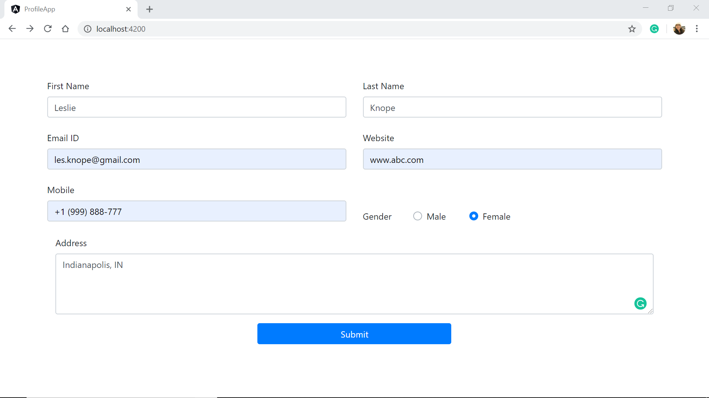
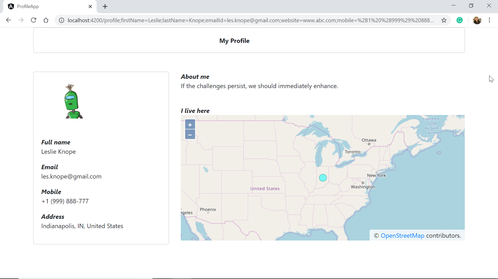

# ProfileApp

This project was generated with [Angular CLI](https://github.com/angular/angular-cli) version 9.0.7.

## Development server
- Clone or download this repository. Make sure node and npm are installed. Run `npm install` to install all required packages.
- Run `ng serve` for a dev server. Navigate to `http://localhost:4200/`. The app will automatically reload if you change any of the source files.

## Project Overview

- The landing page is a user profile form, which takes in details such as name, address, phone, email, etc.

- On filling it up and submitting, it goes to the profile page 
- Profile page displays all the details such as name, address, email, and displays a map for the address.

- Other details such as the Avatar (display picture) and the bio are extracted from a user service. 
- The map can be moved around and controlled through the mouse. Zoom in and zoom out are made possible through +/- buttons, pinch and touch.
- To move the address pin and update the user's address, simply double click on the desired location on the map.

### External APIs and libraries

- Maps used: OpenLayers 6
- Geocoding and reverse-geocoding: HERE API (version 3.1)

## Code scaffolding

Run `ng generate component component-name` to generate a new component. You can also use `ng generate directive|pipe|service|class|guard|interface|enum|module`.

## Build

Run `ng build` to build the project. The build artifacts will be stored in the `dist/` directory. Use the `--prod` flag for a production build.

## Running unit tests

Run `ng test` to execute the unit tests via [Karma](https://karma-runner.github.io).

## Running end-to-end tests

Run `ng e2e` to execute the end-to-end tests via [Protractor](http://www.protractortest.org/).

## Further help

To get more help on the Angular CLI use `ng help` or go check out the [Angular CLI README](https://github.com/angular/angular-cli/blob/master/README.md).
